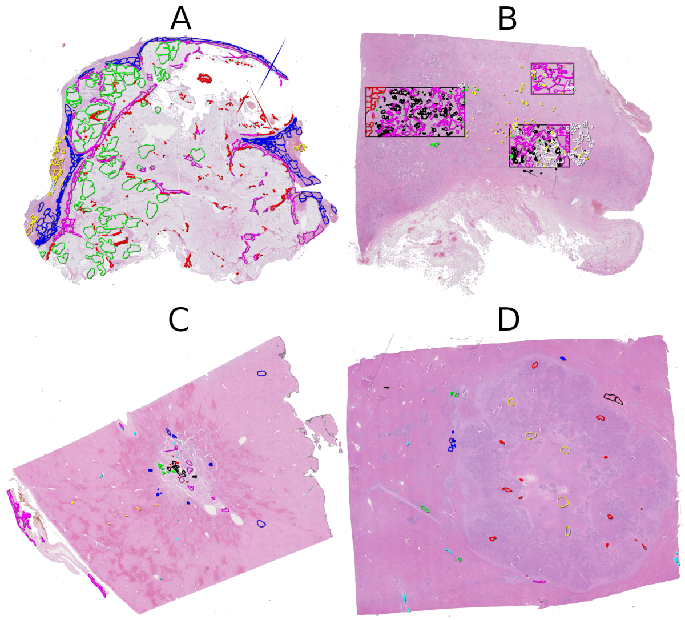
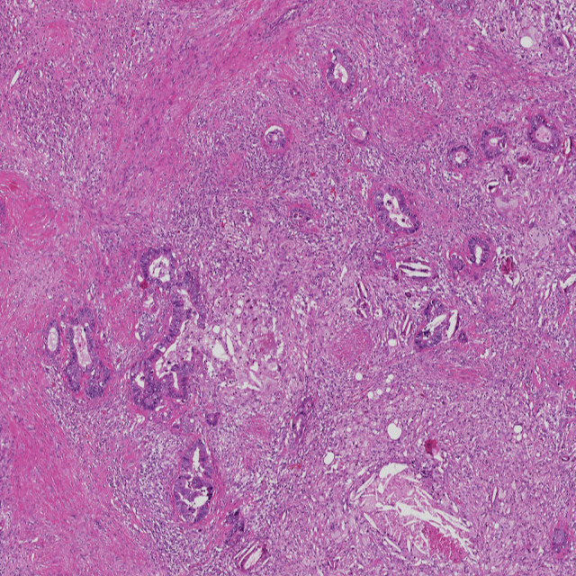
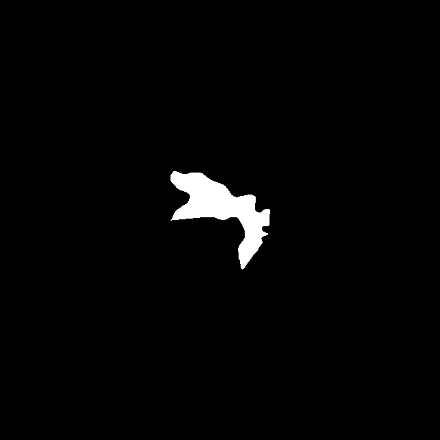
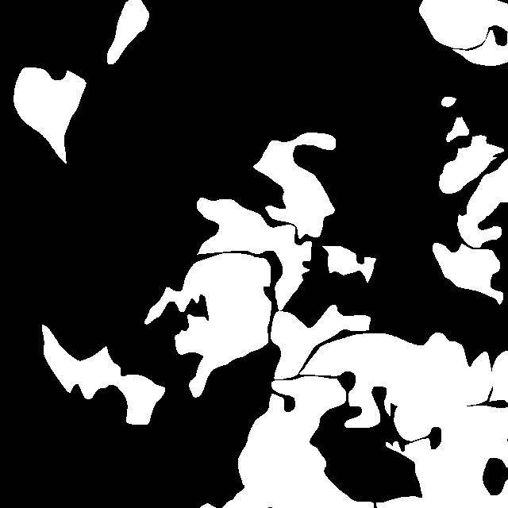
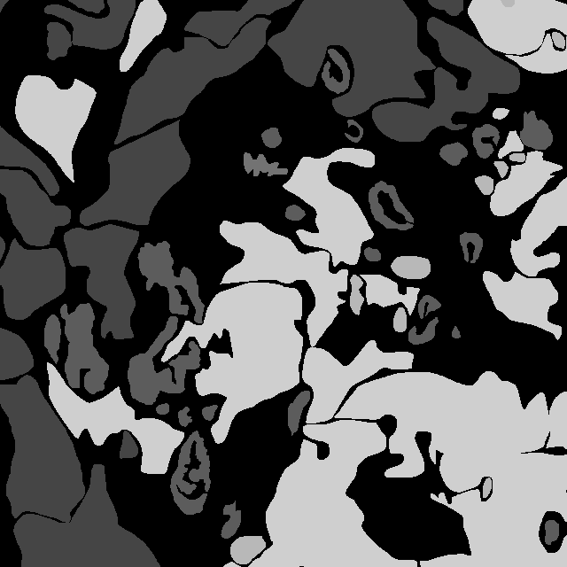

# CRLM processor

Tools to analyze, process and augment the CRLM dataset

<!--  -->


CRLM samples: A, B) Images with good quantity of annotations. C, D) Images scarcely annotated.


## Installation

1. Add to your requirements file:

  ``` bash
  crlm_processor @ https://github.com/giussepi/crlm_processor/tarball/main
  ```

  and run `pip install -r requirements.txt`

  or run

  ``` bash
  pip install git+git://github.com/giussepi/crlm_processor.git --use-feature=2020-resolver --no-cache-dir
  ```
  # or

  pip install https://github.com/giussepi/crlm_processor/tarball/main --use-feature=2020-resolver --no-cache-dir

2. Make a copy of the configuration file and update it properly

	`cp settings.py.template settings.py`

3. Update your main.py following the file main.py.template

## Main Features

## Plot processed WSI
``` python
from Load.Load_model_on_wsi import plot_processed_wsi

plot_processed_wsi('/home/giussepi/Desktop/CRLM_042.ndpi', False, False, 5)
```

### Basic Operations

Use the CRLM class to review the npdi files, extract annotations, bounding
boxes, plot annotations, plot slides, extract masks, create annotations images
with some data augmentation, etc. e.g.:
``` python
from Data.Prepare_patches.CRLM import CRLM

tc = CRLM(index=1, fileroot='/media/giussepi/2_0_TB_Hard_Disk/CRLM/Original/')
tc.plot_slide()
name, tmpim, mask = tc.extract_annotation_image(1, plot=True)
```

### Plot a ROI along with its Annotations
``` python
from Data.Prepare_patches.CRLM import CRLM

tc = CRLM(index=1, fileroot='/media/giussepi/2_0_TB_Hard_Disk/CRLM/Original/')
tc.tc.plot_roi(tc.all_rois[0], line_width=2.5)
```

### Split Dataset into train, validation and test
``` python
# randomly
CRLMSplitDataset(
    dataset_path='/media/giussepi/2_0_TB_Hard_Disk/improved_CRLM_dataset/Annotated - Training set',
    val_size=.1, test_size=.2
)()

# stratified way
CRLMSmartSplitDataset(
    dataset_path='/media/giussepi/2_0_TB_Hard_Disk/improved_CRLM_dataset/Annotated - Training set',
    val_size=.1, test_size=.2
)()
```

### Create Annotation Crops and Masks from one WSI (.ndpi and .ndpa)
Use CRLM.extract_annotations_and_masks to create
``` python
from Data.Prepare_patches.CRLM import CRLM

tc = CRLM(index=1, fileroot='/media/giussepi/2_0_TB_Hard_Disk/improved_CRLM_dataset/Annotated - Training set/')

# without considering ROIs (single annotation per crop)
tc.extract_annotations_and_masks(level=4, min_mask_area=.000001, apply_image_transforms=False)

# Considering all the ROIs in the image (single annotation per crop). See first mask below.
tc.extract_annotations_and_masks(
    level=4, min_mask_area=.000001, apply_image_transforms=False,
	roi_clusters=tc.cluster_annotations_by_roi(), inside_roi=True,
)

# Considering multiple annotations of the same class per crop. See second mask below.
tc.extract_annotations_and_masks(
    level=4, min_mask_area=.000001, apply_image_transforms=False,
    roi_clusters=tc.cluster_annotations_by_roi(), inside_roi=True,
    multiple_ann=True
)

# Considering multiple annotations from all the classes per crop. See third mask below.
tc.extract_annotations_and_masks(
    level=4, min_mask_area=.000001, apply_image_transforms=False,
    roi_clusters=tc.cluster_annotations_by_roi(), inside_roi=True,
    multiple_ann=True, multiple_classes=True
)
```
Example image crop:



Example generated masks:




#### Verifying that one Mask was Correctly cropped
1. Create masks from any slide. E.g.: CRLM 17.ndpi
``` python
tc = CRLM(index=17, fileroot='/media/giussepi/2_0_TB_Hard_Disk/improved_CRLM_dataset/Annotated - Training set/')

# plot single annotation (the main one used to create the crop)
tc.extract_annotations_and_masks(
    level=4, min_mask_area=.000001, apply_image_transforms=False,
	roi_clusters=tc.cluster_annotations_by_roi(), inside_roi=True
)

# plot multiple annotations of the same class along with the main one
tc.extract_annotation_image(291, 2000, 2000,  plot=True, level=4, ann_mgr=tc.get_ann_mgr())

# plot multiple annotations from multiple classes along with the main annotation
tc.extract_annotation_image(
    291, 2000, 2000,  plot=True, level=4, ann_mgr=tc.get_ann_mgr(), multiple_classes=True)
```
2. Open the folder `annotations_masks`, created at the parent directoy of `Annotated - Training set/`, and select a mask to be verified. E.g.: for `T_f017_r00_a00100_c00056.mask.png` the meanings of each part of its name are defined below:

`<label>_f<DNPI file number>_r<roi number>_a<annotation number>_c<crop counter>.mask.png`.

**Note**: When the roi number is -1, it means that the annotation is not inside any ROI.

3. Use the ROI number and the annotation number to plot them together.
``` python
tc.plot_roi(0, annotations=[100], line_width=2.5, level=4)
```
**Note**: If your annotation is not inside a ROI, it has -1 as roi value. Then, you can still plot the image using the following lines:

``` python
_, _, _ = tc.extract_annotation_image(100, plot=True, level=4)
```

4. Make a visual comparison of the plotted image with the mask and image
   patch. They should be a perfect match.

### Analyze the CRLM dataset
Use the CRLMDatasetAnalyzer to get a quick analysis about the CRLM dataset
``` python
from Data.dataset_processors.crlm import CRLMDatasetAnalyzer

CRLMDatasetAnalyzer(
    images_path='/media/giussepi/2_0_TB_Hard_Disk/improved_CRLM_dataset/Annotated - Training set/'
)()
```

### Create Annotation Crops and Masks from the whole CRLM Dataset
Use the CRLMDatasetProcessor data processor. This class can process the CRLM dataset in three different ways: Using only ROIs, using all the annotations, and using all the annotations but considering the ROIs when available. See Data.dataset_processors.constants.CRLMProcessingTypes for a complete description of each processing type.

``` python
from Data.dataset_processors.constants import CRLMProcessingTypes
from Data.dataset_processors.crlm import CRLMDatasetProcessor

CRLMDatasetProcessor(
    level=4,
    images_path='/media/giussepi/2_0_TB_Hard_Disk/improved_CRLM_dataset/Annotated - Training set/'
)(
    min_mask_area=.000001, processing_type=CRLMProcessingTypes.ALL_WITH_ROIS,
	multiple_ann=True, multiple_classes=True
)
```

### Quantify created crops
Quantify the crops per label with the CRLMCropsAnalyzer class
``` python
from Data.dataset_processors.crlm import CRLMCropsAnalyzer

ann_counter = CRLMCropsAnalyzer(
    crops_masks_path='/media/giussepi/2_0_TB_Hard_Disk/improved_CRLM_dataset/annotations_masks_allwithrois/'
)()
```

### Perform data augmentation over the crops & masks per label/class
Use the CRLMAugmentationProcessor to multiply the number of images/crops per class at will. E.g.:
``` python
from Data.dataset_processors.crlm import CRLMAugmentationProcessor, CRLMCropsAnalyzer
from Data.dataset_processors.models import AugmentDict

# using custom class multipliers
# the following code will only duplicate the number of crops and masks from the classs foreign_body
CRLMAugmentationProcessor(
    images_masks_path='/media/giussepi/2_0_TB_Hard_Disk/improved_CRLM_dataset/annotations_masks/',
    augment_dict=AugmentDict(
        hepatocyte=1,
        necrosis=1,
        fibrosis=1,
        tumour=1,
        inflamation=1,
        mucin=1,
        blood=1,
        foreign_body=2,
        macrophages=1,
        bile_duct=1
    )
)()

# calculating class multipliers automatically
CRLMAugmentationProcessor(
    images_masks_path='/media/giussepi/2_0_TB_Hard_Disk/improved_CRLM_dataset/annotations_masks/',
)()

# multiplying the whole dataset times 2
CRLMAugmentationProcessor(
    images_masks_path='/media/giussepi/2_0_TB_Hard_Disk/improved_CRLM_dataset/annotations_masks/',
    class_multiplier=2,
)()

# Verifying/reviewing the results by using the CRLMCropsAnalyzer class

CRLMCropsAnalyzer(crops_masks_path='augmented_dataset')()
```

### Randomly Sample Crop Subdatasets
Use the `CRLMCropRandSample` to randomly sample your crop subdatasets using a user-defined number of
crops/images & masks per label/class.

``` python

CRLMCropRandSample(samples_per_label=1000, dataset_path='/path/to/my/crop_subdataset/')()
```

### Split, Create Crops and Augment in a Single Step
With the class CRLMSplitProcessAugment you can do all the previously mentioned
operations at once. However, should really know the right parameters because it
will take some hours, so you don't want to see errors in the middle of
processing the CRLM dataset!. Thus, we recommend getting some experience using
CRLMSplitDataset, CRLMDatasetProcessor and CRLMAugmentationProcessor classes before
using the CRLMSplitProcessAugment class.

**The most important points to bear in mind are**:
1. All the new folders will be created inside the `dataset_path`.
2. When creating the folder splits (train, val, test), the images and masks will me moved to their
   corresponding folders.
3. The crops and their masks will be created in the folders train_processed,
   val_processed and test_processed.
4. The augmentation of images inside the train_processed folder will be saved at
   the train_processed_augmented folder.
5. **If you want to run CRLMSplitProcessAugment again then you have to the following**:
   1. Move all the images and masks from train, val and test folders to their
      parent folder. I.e. if train, val and test folders are inside
      `/giussepi/CRLM/` (this is the original `dataset_path`) then move the
      images and mask to your `dataset_path`.
   2. Remove all the folders inside your `dataset_path`. Remember not to remove
      the images you moved in the previous step.
   3. Prepare your CRLMSplitProcessAugment configuration and run it!

``` python
from Data.dataset_processors.crlm import CRLMSplitProcessAugment
from Data.dataset_processors.models import AugmentDict

CRLMSplitProcessAugment(
    dataset_path='/media/giussepi/2_0_TB_Hard_Disk/improved_CRLM_dataset/Annotated - Training set (copy)',
    val_size=.1, test_size=.2, level=4, min_mask_area=.000001, multiple_ann=True, multiple_classes=True,
    augment_dict=AugmentDict(
        hepatocyte=1,
        necrosis=2,
        fibrosis=1,
        tumour=1,
        inflamation=2,
        mucin=5,
        blood=7,
        foreign_body=17,
        macrophages=6,
        bile_duct=2
    )
)()

# calculating class multipliers automatically
CRLMSplitProcessAugment(
    dataset_path='/media/giussepi/2_0_TB_Hard_Disk/improved_CRLM_dataset/Annotated - Training set (copy)',
    val_size=.1, test_size=.2, level=4, min_mask_area=.000001, multiple_ann=True, multiple_classes=True
)()
```

### Randomly split a dataset of crops into train, val and test subdatasets
``` python
from Data.dataset_processors.crlm import CRLMRandCropSplit

CRLMRandCropSplit(dataset_path='<path_to_my_crops_dataset>', val_size=.1, test_size=.1)()
```

## LOGGING
This application is using [logzero](https://logzero.readthedocs.io/en/latest/). Thus,
some functionalities can print extra data. To enable this just open your `settings.py` and set
`DEBUG = True`. By default, the log level is set to [logging.INFO](https://docs.python.org/2/library/logging.html#logging-levels).
